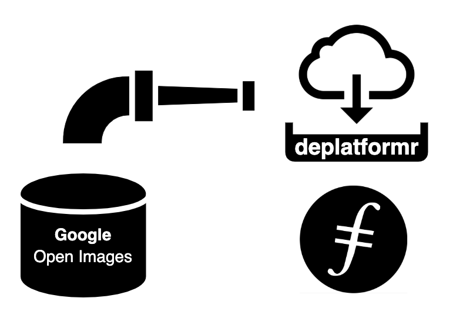

## Deplatformr Open Images
* Download [Google Open Images](https://storage.googleapis.com/openimages/web/index.html) dataset for image machine learning.
* Merge photograpsh with CSV data in industry-standard archival packaging using [schema.org](https://schema.org/ImageObject) based JSON-LD metadata and [Bagit](https://tools.ietf.org/html/rfc8493) containers.
* Upload to Filecoin network using [Pygate](https://github.com/pygate/pygate-gRPC).
* Build a map overlay app from extracted GPS data for the [Filecoin Slingshot](https://slingshot.filecoin.io/) competition.
* Train [Deplatformr](https://deplatformr.com) models on personal datasets using Open Image dataset.

